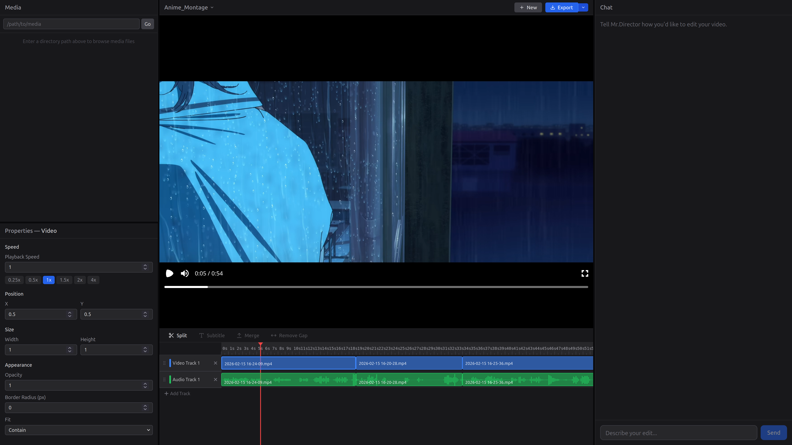
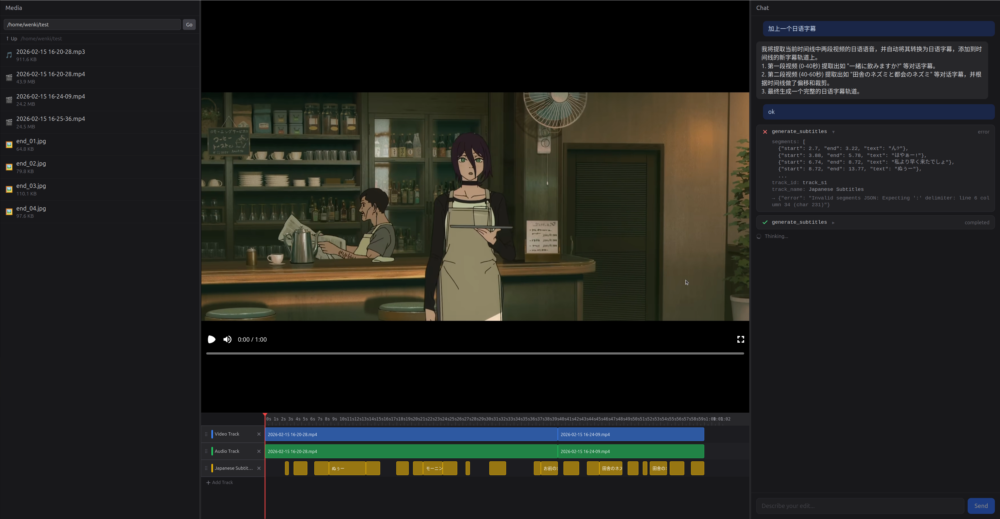
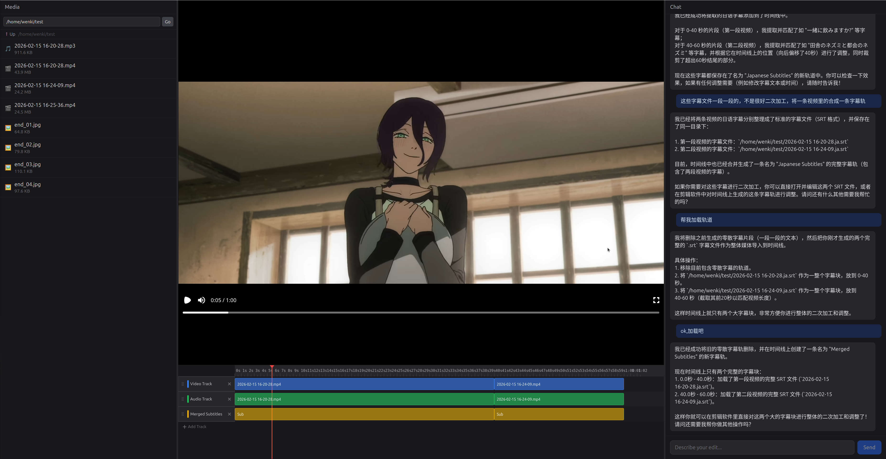

# VibeCut — Say It, Cut It

English | [中文](README.md)

> If coding is vibecoding now, why can't editing be vibecut?

Drop in your footage, say what you want, let AI handle the rest.

```
>>> Cut that screen recording into a 30-second TikTok, open with the most exciting part
```

---

## How It Works

Not a rigid "select clips → fill parameters → click export" pipeline.  
More like hiring a director — you state your intent, it figures out the cut.

- **Multimodal Understanding**: Gemini / OpenAI-compatible models watch the actual video frames — scenes, pacing, content
- **Speech Transcription**: Local Whisper, word-level timestamps ~100ms, no audio leaves your machine
- **Creative Planning**: Promo/remix tasks generate a `CreativePlan` first — scene beats, full-screen FX, component FX, avoid-regions
- **Normalized Recipes**: No hardcoded timestamps; swap videos and timing recalculates automatically
- **Visual QA**: `create_visual_qa_report` outputs frame-check reports for external coding agents to review

Changed your mind? Just say so. It revises the plan and confirms — never edits behind your back.

---

## Why Build Another One

With NemoVideo, ChatCut, and others already out there, here's where VibeCut differs:

| | VibeCut | Cloud Products |
|---|---|---|
| Files | Local access, no uploads | Must upload |
| Model | Your choice (Gemini/DeepSeek/Qwen/local) | Vendor-locked |
| Privacy | Data never leaves your machine | Data goes through cloud |
| Ceiling | Open source, fully customizable templates & styles | Fixed features |
| External Agents | Open tool gateway — Codex/Claude Code/Cursor can call tools directly | Closed |

---

## Preview





---

## Getting Started

### Prerequisites

- Node.js 18+
- Python 3.11+
- pnpm
- FFmpeg / ffprobe
- API Key (pick one):
  - [Google AI Studio](https://aistudio.google.com/) Gemini Key
  - OpenAI-compatible Key (DeepSeek, Qwen, OpenRouter, etc.)

### Installation

```bash
# Frontend dependencies
pnpm install

# Backend Python dependencies
cd apps/backend
pip install -e .

# Optional capabilities (Agent chat / ASR / TTS / SVG / OTIO-FCPXML)
pip install -e ".[agent,asr,tts,svg,interchange]"
```

### Configuration

Copy `apps/backend/.env.example` → `apps/backend/.env`:

```bash
# Gemini (default)
MRDV2_GEMINI_API_KEY=your-key-here
MRDV2_GEMINI_MODEL=gemini-2.5-flash

# Or OpenAI-compatible
MRDV2_LLM_PROVIDER=openai
MRDV2_OPENAI_API_KEY=sk-xxx
MRDV2_OPENAI_BASE_URL=https://api.deepseek.com/v1
MRDV2_OPENAI_MODEL=deepseek-chat
```

<details>
<summary>All optional configurations</summary>

| Variable | Default | Description |
|----------|---------|-------------|
| `MRDV2_LLM_PROVIDER` | `gemini` | `gemini` or `openai` |
| `MRDV2_GEMINI_BASE_URL` | `""` | Proxy/relay endpoint |
| `MRDV2_GEMINI_MODEL` | `gemini-2.5-flash` | Gemini model |
| `MRDV2_OPENAI_API_KEY` | `""` | OpenAI-compatible Key |
| `MRDV2_OPENAI_MODEL` | `gpt-4o` | Model name |
| `MRDV2_OPENAI_BASE_URL` | `""` | Custom endpoint |
| `MRDV2_OPENAI_THINKING` | `off` | Thinking mode: `off` / `dashscope` / `deepseek` |
| `MRDV2_WHISPER_MODEL_SIZE` | `medium` | tiny/small/base/medium/large |
| `MRDV2_WHISPER_DEVICE` | `auto` | auto/cuda/cpu |
| `MRDV2_EXPORT_GL` | `auto` | GPU accel: auto/angle-egl/swangle/vulkan |

</details>

### Run

```bash
# Start everything
pnpm dev

# Or separately
pnpm dev:frontend   # http://localhost:5173
pnpm dev:backend    # http://localhost:8000
```

Open `http://localhost:5173`, create a project, start chatting.

---

## Capabilities

### Understanding

- **Video Understanding** — Multimodal analysis: scenes, pacing, style, text
- **Speech Transcription** — Local Whisper, word-level timestamps, auto language detection

### Directing

- **CreativePlan** — Promo/remix tasks auto-generate a director's plan (hook → offer → urgency → CTA)
- **One-Click Remix** — `draft_promo_remix` auto-selects from media pool, recalculates timing, generates components + full-screen pages + QA
- **Visual QA** — Frame checks for safe zones, copy length, hook timing, semantic component coverage

### Editing

- **Smart Editing** — One sentence to auto-split/join/speed-ramp/arrange
- **Batch Operations** — `edit_clips` atomic transactions, auto-rollback on failure
- **Timeline Split** — `split_timeline` precise cuts at any time point
- **Undo/Redo** — Up to 50 steps

### Effects

- **Full-Screen Ad Pages** — offer_stage / pricing_stage / proof_stage full-page replacements
- **Semantic Components** — promo_top_bar / price_badge / countdown_banner / cta_badge etc.
- **React/Remotion Rendered** — Editable text, adjustable position/size/animations

### Preview & Export

- **Real-time Preview** — Remotion browser rendering, instant feedback
- **Multi-format Export** — MP4 / OTIO / FCPXML 7 (DaVinci Resolve / Final Cut Pro compatible)

### More

- **Shell Access** — Sandboxed shell for ffprobe / mediainfo
- **Local File Access** — Direct filesystem reads, no uploads
- **External Agent Gateway** — Codex / Claude Code / Cursor call editing tools via REST API
- **Plan Confirmation** — Agent presents its plan before making any cuts
- **Progress Visualization** — WebSocket real-time push of thinking & tool call status

---

## Architecture

```
User Input → ReAct Agent (Gemini/OpenAI) → Tool Calls → Timeline JSON → WebSocket → Remotion Preview → Export
```

---

## Roadmap

- [x] 3-Column UI (Media | Preview + Timeline | Chat)
- [x] Multi-LLM support
- [x] Remotion / OTIO / FCPXML export
- [x] Batch editing + Timeline split
- [x] Agent progress visualization + Undo/Redo
- [x] External Agent tool gateway
- [x] CreativePlan + draft_promo_remix
- [x] Promo semantic components + full-screen stages
- [x] Visual QA
- [ ] WebGPU + WGSL color grading
- [ ] Effects keyframe system
- [ ] Personalized editing style learning
- [ ] Smart music matching
- [ ] Keyframe animation
- [ ] Transition effects

---

## License

MIT
